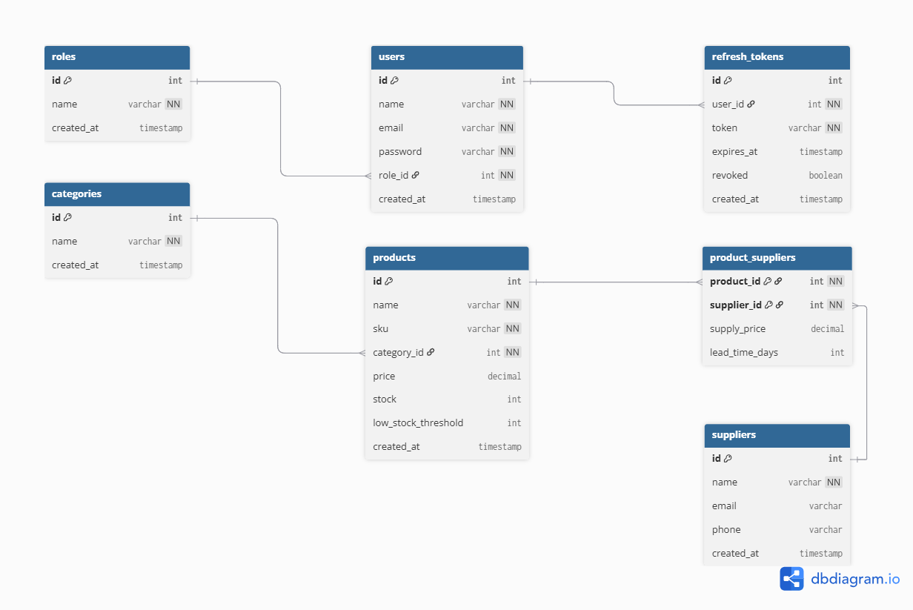

# Inventory Management System (Backend API)

A backend inventory management system built with Node.js and PostgreSQL.
This project is designed as a portfolio project to demonstrate clean architecture,
secure authentication, role-based access control, and real-world API design.

## Tech Stack

- Node.js + Nestjs
- PostgreSQL
- TypeORM
- JWT Authentication (Access Token + Refresh Token)
- bcrypt (password hashing)
- Swagger (API documentation)
- Docker (planned)

## Architecture Overview

The application follows a modular MVC-style architecture.

Main Modules:
- Users Module
- Products Module
- Categories Module
- Suppliers Module
- Reports Module

Each module contains:
- Router (handles HTTP requests and route definitions)
- Controller (processes requests, calls services)
- Service (business logic layer)
- Model / Query (database interaction)
- Middleware (validation, auth guards)

## Database Design

7 tables with clear relationships:

- `roles` → `users` (one-to-many)
- `users` → `refresh_tokens` (one-to-many)
- `categories` → `products` (one-to-many)
- `products` ↔ `suppliers` via `product_suppliers` (many-to-many)

## ERD Diagram

## Project Goals

- Implement clean modular architecture
- Apply JWT authentication with refresh token rotation
- Enforce role-based access control (Admin / Manager / Staff)
- Validate all inputs properly
- Handle errors and edge cases consistently
- Write clean, readable, production-aware code

## Business Rules

- Product SKU must be unique across the system
- Product price must be greater than zero
- Product stock quantity cannot be negative
- Each product belongs to exactly one category
- A product can have multiple suppliers (and vice versa)
- Only Admins can create or delete users
- Refresh tokens are invalidated on logout (revoked flag)
- Low-stock alerts trigger when stock_qty falls below low_stock_threshold

## Features

- Role-based authentication (Admin / Manager / Staff) with JWT
- Refresh token support with logout invalidation
- Product CRUD with category assignment
- Category CRUD
- Supplier CRUD with product linking
- Reports: low-stock alerts, inventory value summary
- Input validation and structured error responses

## Roles & Permissions

| Action                  | Admin | Manager | Staff |
|-------------------------|-------|---------|-------|
| Manage users            | ✅    | ❌      | ❌    |
| Manage products         | ✅    | ✅      | ❌    |
| Manage categories       | ✅    | ✅      | ❌    |
| Manage suppliers        | ✅    | ✅      | ❌    |
| View products & stock   | ✅    | ✅      | ✅    |
| View reports            | ✅    | ✅      | ❌    |

## Future Improvements

- Inventory transactions (purchase & sales history)
- Audit logs (track who changed what and when)
- Pagination & filtering on all list endpoints
- Caching layer (Redis)
- CI/CD pipeline
- Docker Compose setup
- Unit and integration tests